# DiscogsClient

SwiftUI iOS app that integrates with the Discogs API to:

- Search artists.
- Show artist details (including band members when available).
- Browse artist releases with pagination.

## Platform And Stack

- Language: Swift
- Minimum iOS version: 17.0
- UI framework: SwiftUI
- Dependency management: Swift Package Manager (SPM)
- Networking: `URLSession` via `HTTPClient` abstraction
- Tests: XCTest
- Static analysis: SwiftLint (SPM build tool plugin)

## Setup And Run

1. Open `DiscogsClient.xcodeproj` in Xcode.
2. Ensure an iOS 17+ simulator is selected.
3. Configure Discogs token in `DiscogsClient/ApiRequestBuilder.swift` (`token` constant).
4. Build and run the `DiscogsClient` scheme.

## Run Tests

From Xcode:

1. Select the `DiscogsClientTests` schema
2. `Product` -> `Test`

## Architecture And Reasoning

The app uses an MVVM-style structure with clear separation between presentation, mapping, and networking:

- Views render UI and bind state.
- ViewModels calls async requests, pagination, and modifies UI states.
- Mappers convert API payloads into app models and validate responses.
- `HTTPClient` protocol to allow dependency injection and better testability.
- `URLSession` to make network requests by implementing an extension in `HTTPClient+URLSession.swift`.

This choice was made because it facilitates a lot when implementing unit tests, specially using dependency injection when creating the ViewModels. The structure also alows easy navigation between view and data components. Good separation of concerns makes implementing new features more easily and faster. For me, tests are a must, it gives a lot of confidence when making new changes on existing code.

## Analysis And Development Process

1. Implement search flow.
2. Implement artist detail flow.
3. Implement releases flow.
4. Add tests for critical ViewModel behaviors.
5. Move requests creation to `ApiRequestBuilder.swift`
6. Add SwiftLint for quality checks.
7. Lots of tests pointing to the DiscogsApi.

- And some tasks that were continuous during all the test:
  - Improving `endpoint.md` with the contracts based on testing the real DiscogsApi.
  - UI improvements, using new liquid glass components.
  - Keep the business logic and UI separated.

## Challenges on the `albums` endpoint

1. Data problems with the albums endpoint:
   - Duplicated ids on results (`screenshots/duplicate_release_results.png`). This was fixed by deduping the responses on the albums view model.
   - No support for filters, the filtering has to be done locally. This raises some bad UX, like the filters increasing in size as the user paginates (older records add older years to the filter).
   - No "genre" support in `/artists/{id}/releases`. The endpoint does not expose reliable genre property in the response. Year/label are derived from the json fields and processed locally. That's why I added the "Genre" filter but disabled.

2. Can't use the `/search` endpoint to fetch only **albums** because the endpoint also returns albums from other bands with the same name. To get more reliable data it's better to use `/artists/{id}/releases`.

3. We don't have a direct way to define if a release is an album or not. To mitigate this, the app uses a group of properties to try to determine that a release is an album, you can check the condition in `ArtistAlbumsMapper.swift`

## Static Analysis

- SwiftLint is configured through SPM. Run by building the project in Xcode.
- Really useful for removing unused blank space and enforcing conventions, like: `var imageUrl: URL?` in favor of `var imageUrl: URL? = nil`

## Project Structure

- `DiscogsClient/ArtistSearch`: artist search feature
- `DiscogsClient/ArtistDetail`: artist detail feature
- `DiscogsClient/ArtistAlbums`: artist releases and filters
- `DiscogsClient/Models`: models and pagination metadata
- `DiscogsClientTests`: ViewModel unit tests
- `endpoint.md`: JSON response contracts
- `screenshots/`: UI screenshots

## Screenshots

### Search

  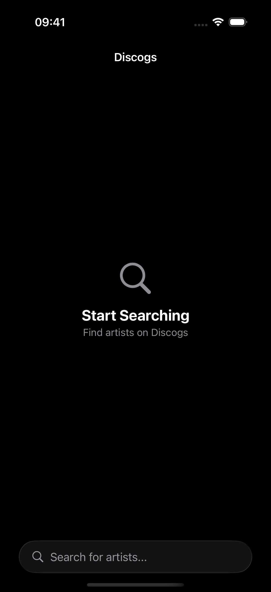
  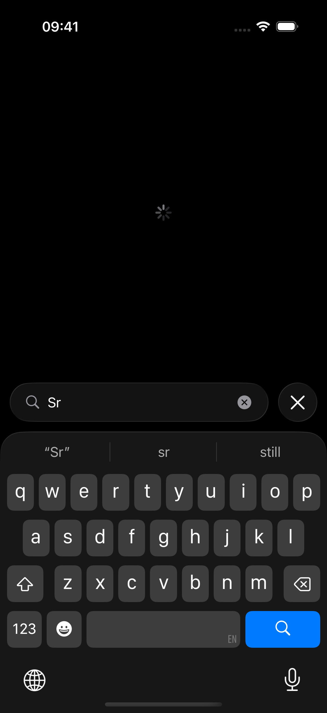
  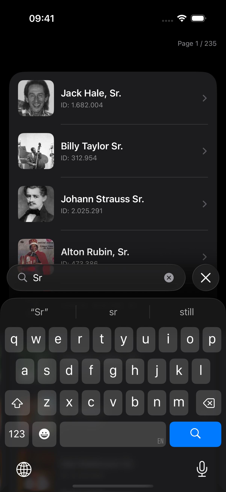

  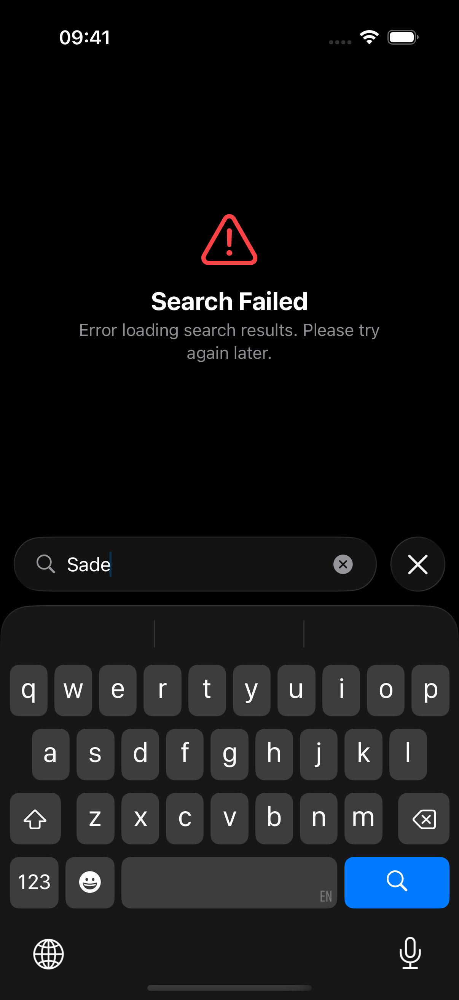
  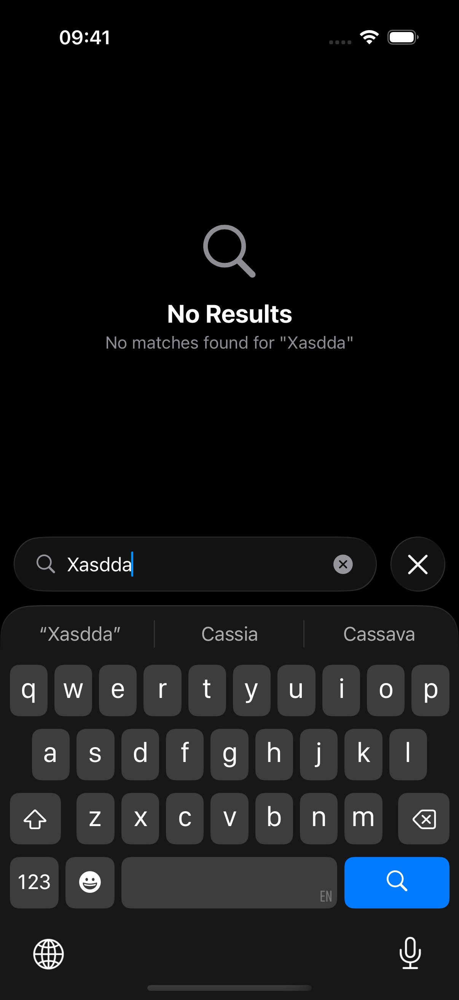
  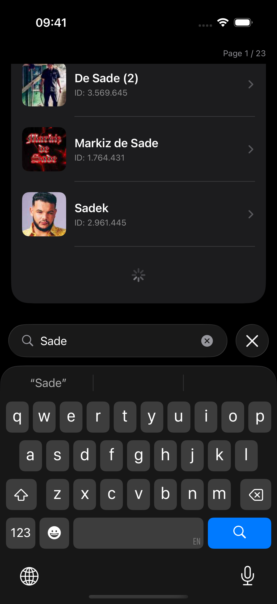

  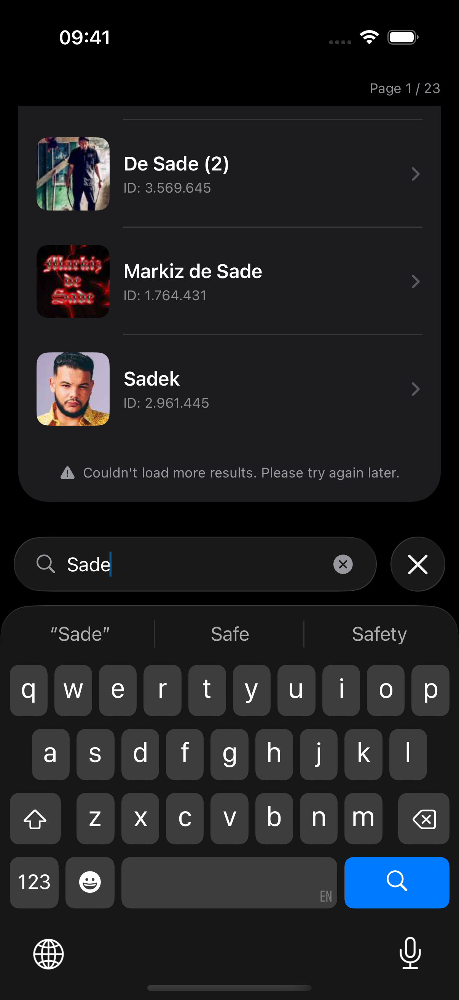

### Artist Details

  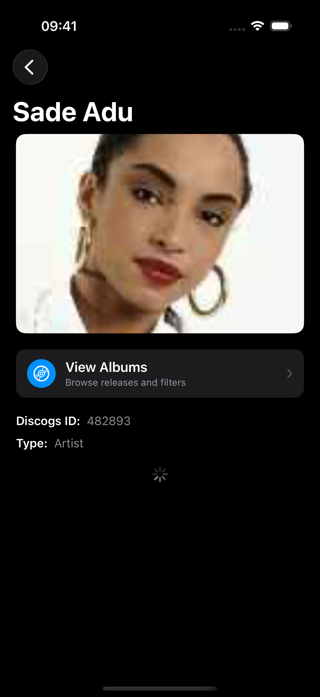
  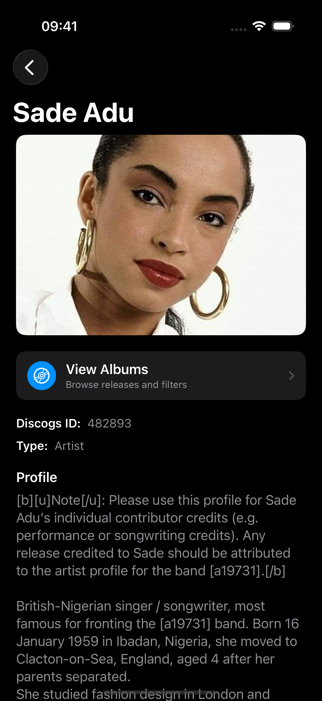
  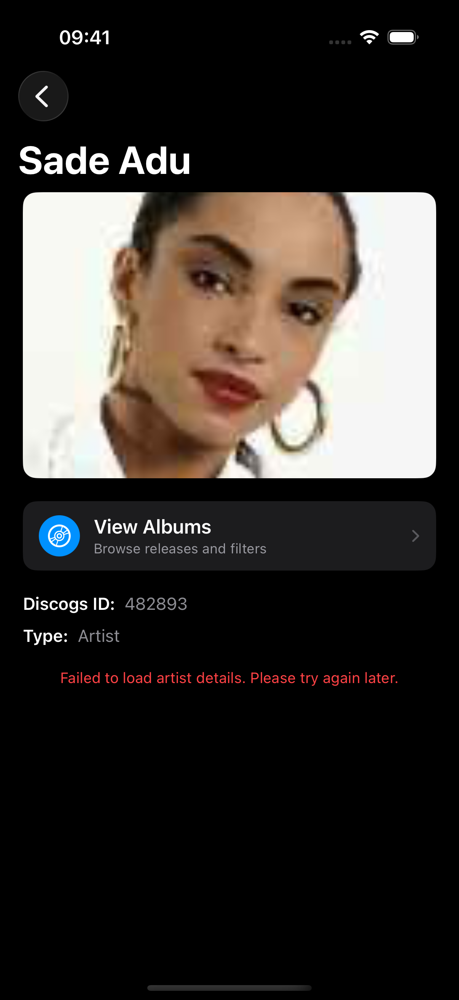

  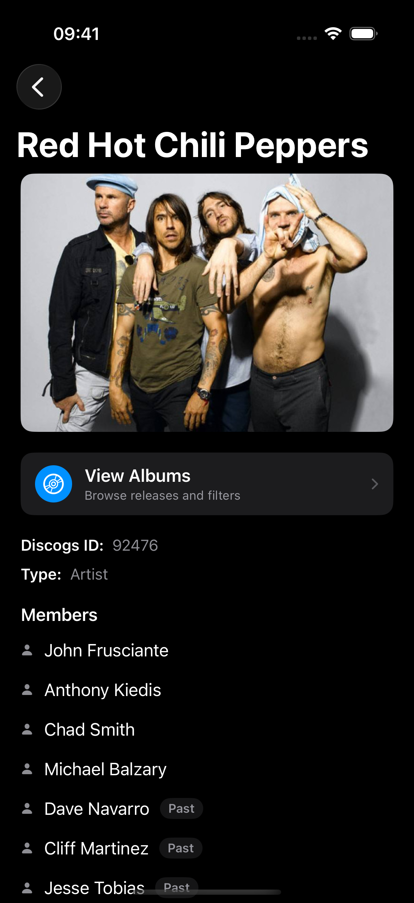

### Albums

  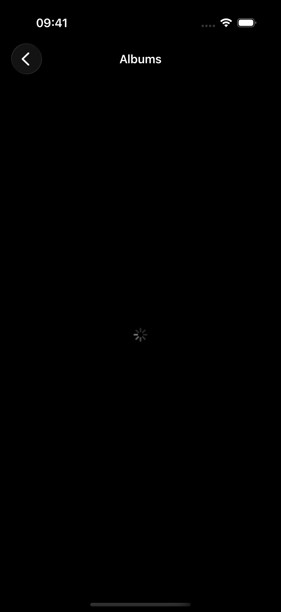
  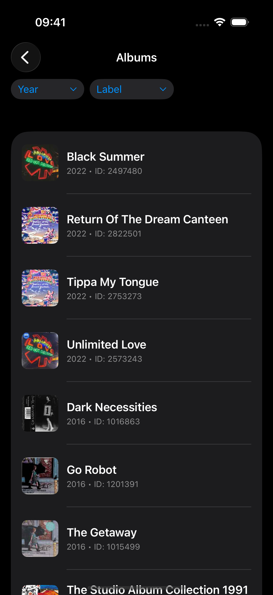
  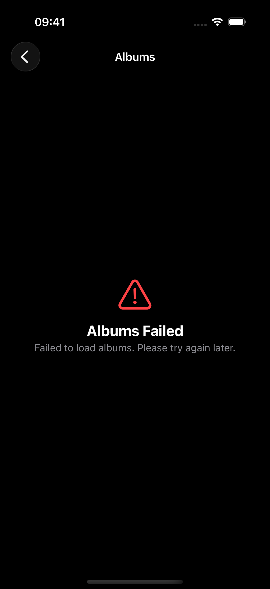

  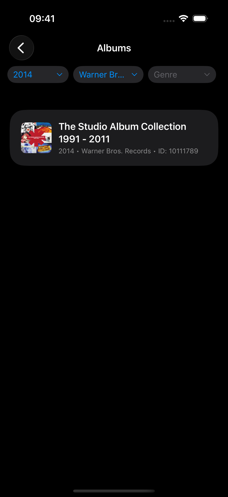
  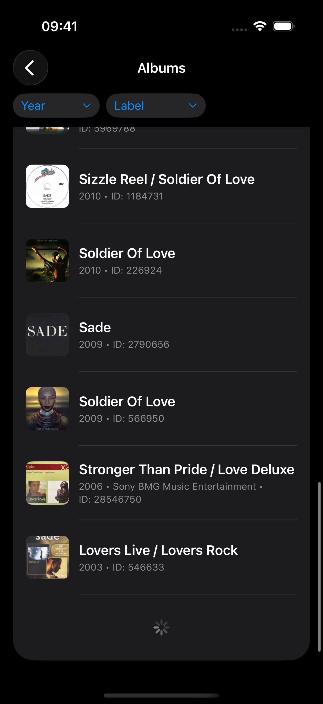
  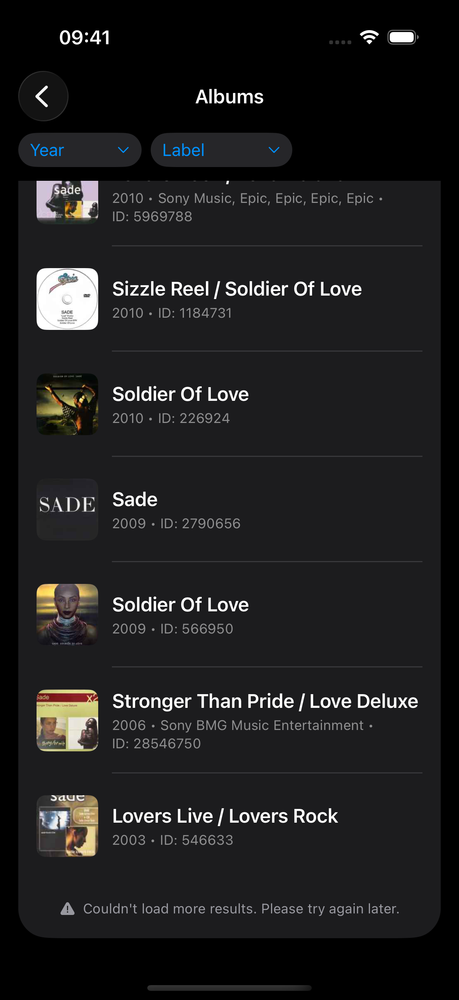

